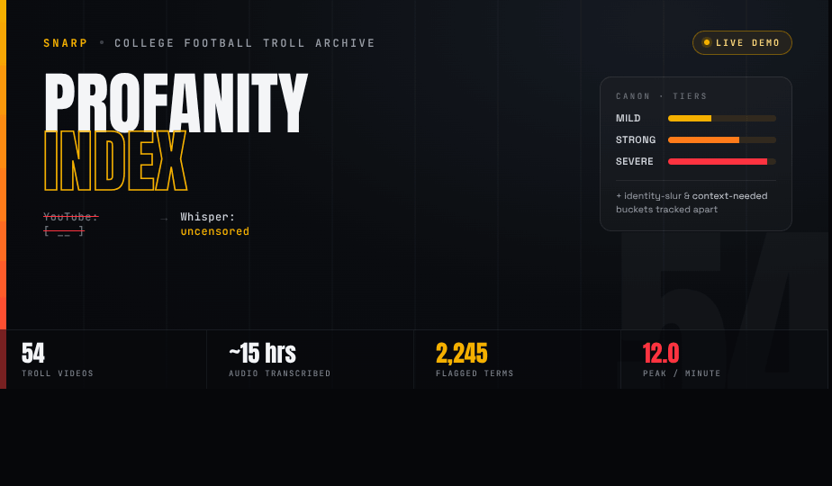
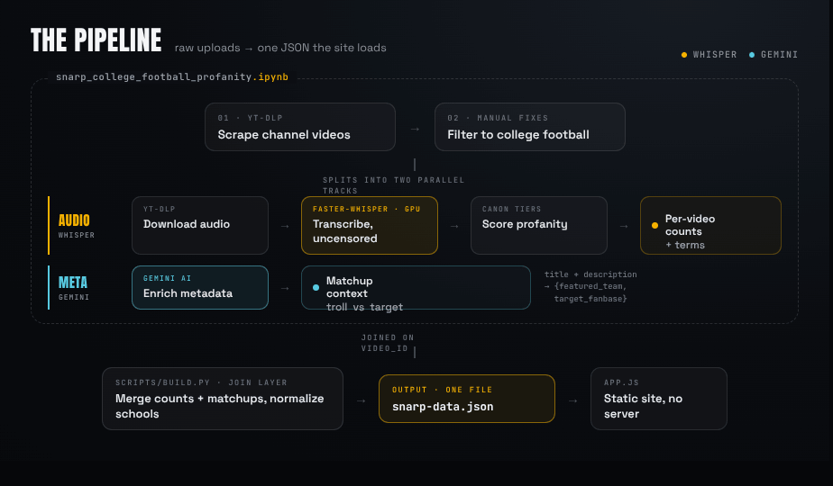

<div align="center">



<br>
<br>

[](https://nina-mir.github.io/snarp-analysis/)
[](#)
[](snarp_college_football_profanity.ipynb)
[](#the-pipeline)
[](#the-pipeline)

**A tiered linguistic analysis of 54 college-football "troll" videos from the SNARP YouTube channel** — every curse, slur, and flagged term, normalized by length and mapped across matchups, programs, and the transcripts themselves.

**[Live demo &nbsp;&rarr;](https://nina-mir.github.io/snarp-analysis/)** &nbsp;·&nbsp; [The notebook](snarp_college_football_profanity.ipynb) &nbsp;·&nbsp; [How scoring works](#how-profanity-is-scored--canon-tiers)

</div>

---

## The pipeline

<div align="center">

</div>

All data processing lives in [`snarp_college_football_profanity.ipynb`](snarp_college_football_profanity.ipynb). It scrapes the channel, isolates the audio, transcribes it with **Whisper**, scores the profanity, and — on a parallel track — enriches each video's metadata with **Gemini** to recover who was trolling whom.

> **Why Whisper.** YouTube's own captions censor profanity as `[ __ ]`. Re-transcribing the raw audio (`faster-whisper`, `medium`, GPU, fp16) recovers the uncensored speech the whole analysis depends on.
>
> **Why Gemini.** It reads each video's title and description and returns a structured `{featured_team, target_fanbase}` matchup, turning unstructured metadata into the troll-vs-trolled labels the rankings need.

## The build step — `scripts/build.py`

`scripts/build.py` is the join layer between the notebook's two outputs and the website. It

- loads the per-video profanity counts and per-term breakdowns,
- attaches each video's Gemini matchup, and
- normalizes every school name to a single canonical form — so `Pittsburgh Panthers`, `Pitt`, and `pittsburgh` collapse to one program.

It then writes everything to a single [`build/snarp-data.json`](build/snarp-data.json) that the static front-end (`app.js`) loads at runtime. No server, no database.

## How profanity is scored — CANON tiers

Scoring runs off **`CANON`**, a dictionary of canonical words mapped into three severity tiers. Identity slurs and ambiguous terms are kept in their own buckets — never folded into the tiers.

| Tier | What it captures |
| :--- | :--- |
| **Mild** | everyday swears, lightest weight |
| **Strong** | harsher profanity |
| **Severe** | the heaviest terms |
| _Identity slurs_ | race- and sexuality-directed terms, tracked **separately** |
| _Context-needed_ | ambiguous terms like "gay" that aren't auto-counted |

The mechanics:

- **Tokenization** — each transcript is split with a regex that also captures partially-censored tokens like `f***`.
- **Censored-token matching** (`matches()`) — aligns a token's visible head and tail letters against each canonical word and checks the asterisk run could plausibly fill the gap. Word-boundary-aware, so `hell` never fires inside `hello`.
- **Per-video rate** — tier counts are summed and divided by the clip's duration to yield a length-normalized **profanity-per-minute** score.

## Project layout

```text
snarp-analysis/
├── snarp_college_football_profanity.ipynb   # scrape → transcribe → score → enrich
├── scripts/
│   └── build.py                             # join + normalize → snarp-data.json
├── build/
│   └── snarp-data.json                      # the single artifact the site loads
├── data/
│   ├── transcripts/                         # Whisper output, one file per video
│   └── game-context/                        # Gemini matchup, one file per video
├── app.js                                   # static front-end
└── index.html
```

## Run it

```bash
python scripts/build.py   # regenerates build/snarp-data.json
```

Re-running the full notebook additionally requires a GPU for `faster-whisper` and a Gemini API key for the enrichment pass.

---

<div align="center">
<sub>54 troll videos · ~15 hours of audio · 2,245 flagged terms · transcribed uncensored, scored by tier.</sub>
</div>
